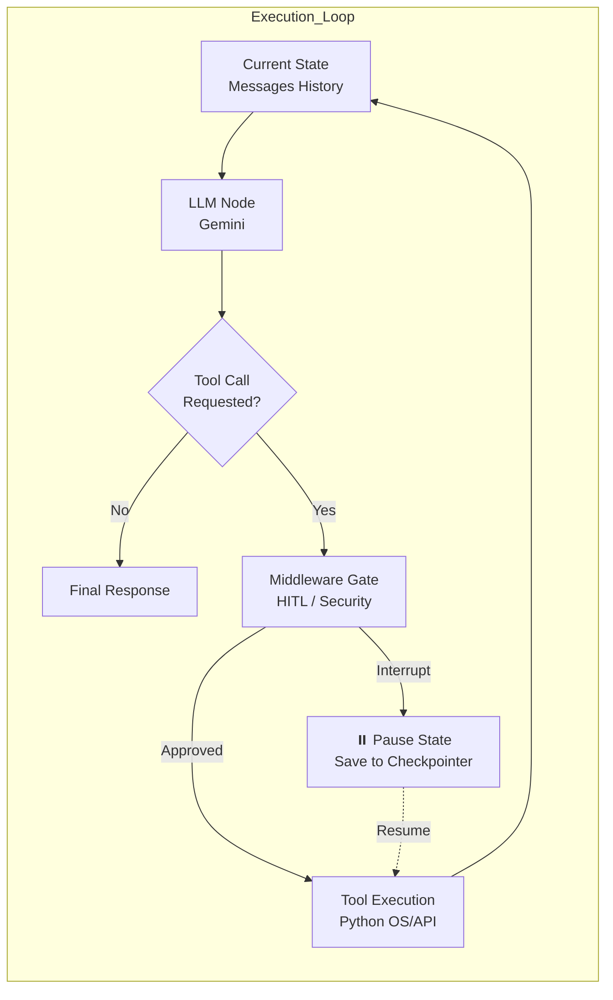
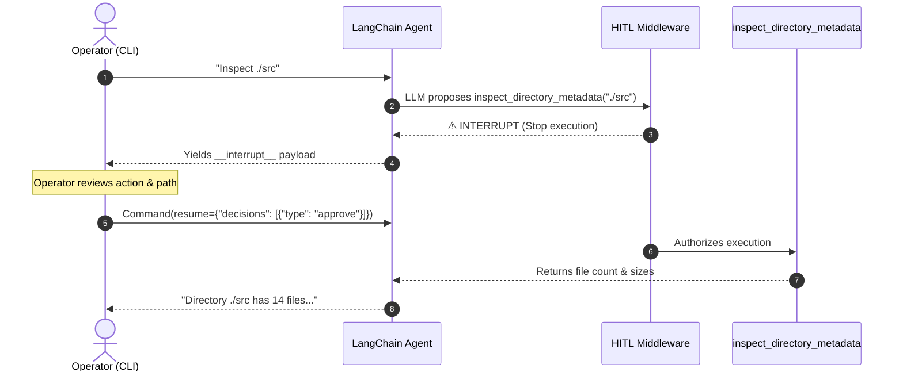

# 🧠 LangChain Agent Architecture: Mental Model & Breakdown
> **Target Audience:** Data Scientists / Neuroscientists  
> **Format:** Visual, low cognitive load, chunked bullet points, zero text walls.

---

## 1. 🗺️ The High-Level Paradigm: A Discrete-State Machine

In modern LangChain / LangGraph, an Agent is **not** an opaque script or a chain of prompts.  
It is a **Stateful Directed Graph (State Machine)** executed in discrete time steps:

$$\text{State}_{t+1} = f(\text{State}_t, \text{Event})$$



---

## 2. ⚡ The Paradigm Shift: Prompts vs. Middleware

| Mechanism | Nature | Failure Mode | Scientific Analogy |
| :--- | :--- | :--- | :--- |
| **System Prompt** | **Probabilistic** (Soft constraint) | Hallucination, jailbreak, instruction drift | Neuromodulation (shifts bias, but no hard guarantee) |
| **Middleware** | **Deterministic** (Hard constraint) | None (enforced by Python control flow) | Refractory period / Voltage-gated ion channel (all-or-none) |

> 📌 **Takeaway:** Never ask an LLM in the prompt to *"please ask permission before inspecting disks"*.  
> Instead, let the LLM generate the intent, and let **Middleware** intercept the call deterministically.

---

## 3. 🧩 Component-by-Component Breakdown

### A. The Schema & Tools (`tools.py`)
* **What a Tool really is:** An ordinary Python function + an auto-generated JSON Schema (`name`, `description`, `args`).
* **The LLM role:** The LLM **never** runs Python code. It outputs a structured JSON intent:
  ```json
  {"name": "inspect_directory_metadata", "args": {"dir_path": "./src"}}
  ```

---

### B. The 2 Middlewares (`backend.py`)

#### 1. `HumanInTheLoopMiddleware` (Deterministic Gate)
```python
interrupt_on={
    "inspect_directory_metadata": True,   # 🛑 Gate active
    "get_system_metrics": False,          # 🟢 Auto-pass
    "check_endpoint_health": False        # 🟢 Auto-pass
}
```
* **Event:** Intercepts the state *after* the model outputs a tool call, but *before* the tool executes.
* **Action:** Halts graph execution, raises `__interrupt__`, and writes frozen state to memory.

#### 2. `SummarizationMiddleware` (Context Window Compression)
```python
trigger=("messages", 6)  # Compress when message count >= 6
keep=("messages", 2)     # Preserve the 2 most recent turns
```
* **Problem:** Chat history grows linearly ($O(N)$ tokens), increasing latency and cost.
* **Mechanism:** Acts as an automatic lossy compression step: summarizes turns $1 \dots N-2$ and preserves turn $N-1$ and $N$.

---

### C. State Checkpointer (`MemorySaver` / `MongoDBSaver`)
* **Why it is required:** LangGraph cannot perform an interrupt without a persistence layer.
* **Analogy:** Serializing graph state to disk/RAM like a checkpoint in PyTorch or saving a game save-file.
* **Thread ID:** Each user session has a unique `thread_id` acting as the primary key for state retrieval.

---

## 4. 🔄 The HITL Handshake Protocol (CLI ↔ Agent)



---

## 5. 🎯 Decision Matrix for Operator (Resume Options)

When an interrupt fires, the harness can supply 3 resume actions:

| Action | Payload Schema | What happens under the hood |
| :--- | :--- | :--- |
| **Approve** | `{"type": "approve"}` | Executes original tool call with original args |
| **Edit** | `{"type": "edit", "edited_action": {"name": "...", "args": {...}}}` | Replaces args (e.g. alters path to safe subfolder) before execution |
| **Reject** | `{"type": "reject", "message": "reason"}` | Cancels execution, injects error message into conversation so LLM adapts |

---

## 6. 🚀 Quick Reference Commands

```bash
# 1. Activate environment
source .venv/bin/activate

# 2. Run interactive session
python -m system_health_agent.main
```
